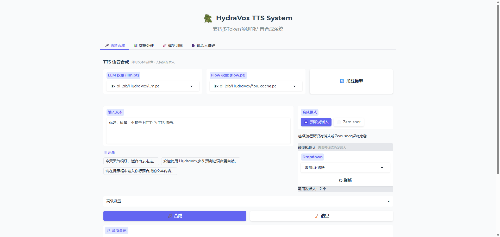

<div align="center">


# FlowMirror-HydraVox

**A natively accelerated TTS (text-to-speech) model with multi-head decoding, derived from CosyVoice.**

[English] · [Simplified Chinese](README-zh.md)

</div>

---

<p align="center">
  <a href="#-highlights">Highlights</a> •
  <a href="#-quickstart-1-minute">Quickstart</a> •
  <a href="#webui">WebUI</a> •
  <a href="#roadmap">Roadmap</a> •
  <a href="#python-api">Python API</a> •
  <a href="#models--weights">Models</a> •
  <a href="#train--finetune">Train</a> •
  <a href="#license">License</a>
</p>

<p align="center">
  
  
  
  
</p>

---

## ✨ Highlights

* **Multi‑Head AR Decoding** — Predict multiple speech tokens per step → **lower latency** and **higher throughput** under the same quality target.
* **Ready‑to‑use WebUI** — Inference, flash batch synthesis, fine‑tuning (coming soon), speaker management, logs/plots.
* **Hot‑load LoRA for emotion/style** (coming soon) — Load/unload adapters at runtime per utterance; stack multiple with per‑adapter scaling (e.g. `--lora happy.safetensors:0.6,energetic.safetensors:0.3`).
* **SFT implementation** — Derived from CosyVoice 3.0.
* **Reproducible scripts** — One‑command demo and fully version‑locked configs.
* **CosyVoice3.0‑derived** — Clear deltas vs upstream; compatible data formats where possible.

> **Responsible use:** Please do not clone or impersonate voices without explicit consent.

---

## 🔊 Samples & Demo

* **Audio samples**: `assets/samples`
* **Online demo**: `http://localhost:7890` — link to Space/website.

---

## 🚀 Quickstart (1 minute)

> **Prereqs**: Python 3.10+, FFmpeg installed and on PATH; NVIDIA GPU + CUDA 12.x recommended. CPU fallback supported (slower).

### From source

```bash
# 0) Clone
git clone https://github.com/jingzhunxue/FlowMirror-HydraVox.git
cd FlowMirror-HydraVox

# 1) Create conda env
conda create -n hydravox python=3.11

# 2) Install dependencies
pip install -r requirements.txt

# 3) Download model weights
modelscope download jzx-ai-lab/HydraVox-CV3 --local_dir jzx-ai-lab/HydraVox-CV3

# 4) Create .env
cp .env.example .env
```

---
<a name="webui"></a>
## WebUI

Start:

```bash
python main.py --api-host 0.0.0.0 --api-port 7860 --with-ui
# API-only mode (no browser UI):
python main.py --api-host 0.0.0.0 --api-port 7860
```

Features:

* Text → Speech, long‑text chunking.
* **Data Process panel**: dataset browser, configs, live logs & curves.
* **Training/Finetune panel**: dataset browser, configs, live logs & curves.
* **Speaker manager**: add/rename/delete speakers, preview, embeddings.

Screenshots:

<p align="center">
  
  
  <!-- If the images are large, adjust width to 45%-49% to keep them on one line. -->
</p>

**Data directories** (defaults, overridable):

```
jzx-ai-lab/HydraVox-CV3      # model weights
logs/                    # train/infer logs
```

---
<a name="roadmap"></a>
## Roadmap

...
* 2026/01
  - [ ] DeepSeek-style Multi-Token Prediction module for HydraVox to enable more powerful and stable inference
  - [ ] Flow-matching core update introducing a TTS-tailored paradigm

* [ ] 2025/12
  - [X] Release training UI tab and training scripts
  - [ ] Release LoRA hot-load and inference with pretrained emotion LoRA
---

## Python API

REST endpoints (FastAPI; default prefix `/api/v1`). Below are minimal Python examples and key fields.

```python
import base64
import requests

BASE = "http://localhost:8888/api/v1"

def load_pt(llm_pt: str, flow_pt: str):
    resp = requests.post(f"{BASE}/load_pt", json={
        "llm_pt": llm_pt,
        "flow_pt": flow_pt,
    }, timeout=120)
    resp.raise_for_status()
    print(resp.json())
    return resp.json()

def list_speakers():
    resp = requests.get(f"{BASE}/speakers", timeout=30)
    resp.raise_for_status()
    return resp.json()

def tts(text: str, speaker_id: str,
        output_format: str = "wav",
        last_prompt: bool = True,
        extra_params: dict | None = None):
    payload = {
        "text": text,
        "speaker_id": speaker_id,
        "output_format": output_format,
        "last_prompt": last_prompt,
        "extra_params": extra_params or {
            "top_p": 0.9,
            "top_k": 10,
            "win_size": 32,
            "tau_r": 0.2,
            "inference_head_num": 2
        }
    }
    resp = requests.post(f"{BASE}/tts", json=payload, timeout=90)
    resp.raise_for_status()
    data = resp.json()
    if not data.get("success", True):
        raise RuntimeError(data.get("error") or data.get("message"))
    audio_b64 = data["data"]["audio_base64"]
    with open(f"out_tts.{output_format}", "wb") as f:
        f.write(base64.b64decode(audio_b64))
    return data

def zero_shot(tts_text: str, prompt_text: str, prompt_wav_path: str,
              output_format: str = "wav",
              extra_params: dict | None = None):
    with open(prompt_wav_path, "rb") as f:
        prompt_audio_base64 = base64.b64encode(f.read()).decode("utf-8")
    payload = {
        "tts_text": tts_text,
        "prompt_text": prompt_text,
        "prompt_audio_base64": prompt_audio_base64,
        "output_format": output_format,
        "extra_params": extra_params or {
            "top_p": 0.9,
            "top_k": 10,
            "win_size": 32,
            "tau_r": 0.2,
            "inference_head_num": 2
        }
    }
    resp = requests.post(f"{BASE}/zero-shot", json=payload, timeout=120)
    resp.raise_for_status()
    data = resp.json()
    if not data.get("success", True):
        raise RuntimeError(data.get("error") or data.get("message"))
    with open(f"out_zero_shot.{output_format}", "wb") as f:
        f.write(base64.b64decode(data["data"]["audio_base64"]))
    return data

# Example usage
# load_pt("checkpoints/llm.pt", "checkpoints/flow.pt")
# speakers = list_speakers(); print(speakers)
# tts("The weather is great today.", speaker_id="spk1")
# zero_shot("Please read the following text: Hello world.", "Hello, this is what my voice sounds like.", "assets/samples/prompt.wav")
```

**Key arguments**

- **POST `/api/v1/tts`**
  - **text**: Text to synthesize (required)
  - **speaker_id**: Speaker ID (required; query via `/speakers`)
  - **output_format**: Output format, default `wav`
  - **last_prompt**: Use the previous audio as a zero‑shot prompt, default `true`
  - **extra_params**: Inference hyperparameters (optional)
    - `top_p`=0.9, `top_k`=10, `win_size`=32, `tau_r`=0.2, `inference_head_num`=2
  - **Response**: `{ success, message, data: { audio_base64, sample_rate, format, duration, speaker_id, segments_info } }`

- **POST `/api/v1/zero-shot`**
  - **tts_text**: Text to synthesize (required)
  - **prompt_text**: Text describing/matching the prompt audio (required)
  - **prompt_audio_base64**: Base64 of the prompt audio (required)
    - e.g. `base64.b64encode(open('prompt.wav','rb').read()).decode('utf-8')`
  - **output_format**: Output format, default `wav`
  - **extra_params**: Same as above
  - **Response**: `{ success, message, data: { audio_base64, sample_rate, format, duration, segments_info } }`

- **POST `/api/v1/load_pt`**
  - **llm_pt**: Path to LLM weights (required)
  - **flow_pt**: Path to Flow weights (required)
  - **Response**: `{ success, message, data | error }`

- **GET `/api/v1/speakers`**
  - **Purpose**: List available speakers
  - **Response**: Either a raw list or wrapped as `{ success, ... }`

Notes:
- `/tts` has ~60s server-side timeout; split long text or allocate more resources.
- `prompt_audio_base64` should be the Base64-encoded bytes of the original audio file.
- Decode `audio_base64` with `base64.b64decode(...)` and save to a file.

---

## Models & Weights

| Name                  | Params | Langs   | type   | Multi‑Head | Link  |
| --------------------- | -----: | ------- | --------- | ---------: | ----- |
| hydravox-base-pretrained         | ~300M | zh/en   |AR-Transformer  |          5 | https://www.modelscope.cn/models/jzx-ai-lab/HydraVox-CV3/file/view/master/llm.pt |

> Download total weights by ```
modelscope download jzx-ai-lab/HydraVox-CV3 --local_dir jzx-ai-lab/HydraVox-CV3```

---
## Train & Finetune

### Use the WebUI for data preprocessing (Data Process)

Open the WebUI and go to the "Data Process" tab. You can run a one‑click pipeline or each stage individually.

- One‑click pipeline: In "One‑click pipeline — Run all four stages automatically", fill Input directory, Sample rate, and Overwrite, then click Start. The UI runs all four stages sequentially with overall progress, status, and logs.
- Output directory convention:
  - Stage 1 (Convert & Resample) → `<input>_resample`
  - Stage 2 (VAD) → `<stage1_output>_vad`
  - Stage 3 (ASR Transcription) → `<stage2_output>_asr`
  - Stage 4 (Token Extraction) → `<stage3_output>_token`
  - Stage 5 (optional, Merge Datasets) → saved to the directory you specify

Per‑stage notes (accordions in the UI):
- Stage 1 — Convert & Resample
  - Choose input/output directories and sample rate (16 kHz by default), optionally overwrite existing files
  - "Preview changes" shows source → target mapping, then click "Start"
- Stage 2 — VAD (Silero)
  - Key params: confidence threshold, min speech/silence (ms), pad (ms), min/max segment length (s)
  - Shows progress and logs while running
- Stage 3 — ASR Transcription
  - Device: Auto/CPU/GPU; number of processes (GPU count); supports refresh device detection
  - Outputs a HuggingFace dataset directory
- Stage 4 — Token Extraction
  - Same device/process settings as above
  - Outputs a tokenized dataset directory
- Stage 5 — Merge Datasets (optional)
  - Provide multiple dataset directories (comma‑separated), the merged dataset is saved to your target dir

Tip: The UI auto‑detects CUDA and GPU count. VAD/ASR default to 16 kHz. Each stage exposes status and logs for troubleshooting.

### Training (WebUI: Train)

Set the following in the "Train" tab and click "Start training":

- 1) Dataset
  - Training dataset path: select the dataset produced by Stage 3/4 (e.g., `<...>_asr` or `<...>_token`)
- 2) Model
  - Model type: `llm` or `flow`
  - Model checkpoint: e.g., `jzx-ai-lab/HydraVox-CV3/llm.pt`
  - Tokenizer path: e.g., `jzx-ai-lab/HydraVox-CV3/CosyVoice-BlankEN`
  - Output directory: e.g., `checkpoints/training_llm`
- 3) Training params
  - Batch size, learning rate, epochs, save interval (steps), logging_steps, eval_steps
  - Validation: auto split by ratio or provide an existing validation set (falls back to auto split if not found)
- 4) Advanced
  - Enable LoRA fine‑tuning (optional)
  - Precision: BF16/FP16 (with per‑model recommendations)
- 5) Compute resources
  - Device: Auto/CPU/GPU; number of processes (GPU count); optional GPU IDs; refresh device detection
- 6) Control & visualization
  - Logs: live in the panel, also saved to `logs/training/train_<timestamp>.log`
  - Curves: generated and saved to `<output_dir>/figure/training_plot.png`
  - Buttons: "Refresh now" / "Force refresh" and auto refresh with a timer

Note: Training is launched via Accelerate; precision maps to mixed_precision (`bf16`/`fp16`). `logging_steps` and `eval_steps` determine step ticks in logs and plots.

### Model management

The "Model management" panel offers quick operations for training outputs:
- List: show discovered output paths in reverse chronological order (scans `checkpoints/training_llm`, `checkpoints/training_flow`, `checkpoints/training`, `checkpoints`, `models`, `outputs`, `ckpt`, ignoring `runs/logs/figure`)
- Refresh list: rescan directories
- Load path: echo the selected path into the input box for later operations
- Delete path: remove the selected folder (system folders like `runs/logs/figure` are protected)
- Convert to `model.pt (bf16)`: convert a `pytorch_model.bin` to `model.pt`
  - Sharded weights with `.bin.index.json` are not supported; please merge first

Note: Ensure sufficient disk space and GPU resources for large‑scale processing and training. If the plot does not refresh after training, click "Force refresh".

---

## License

* Code: **Apache‑2.0** *(example — update to your actual license)*.
* **Derived from CosyVoice** — see `NOTICE` and `LICENSE-THIRD-PARTY` for upstream licenses and modifications.

---

## 📚 Citation

```bibtex
@software{hydravox2025,
  title = {FlowMirror-HydraVox: Multi-head AR TTS with Native Acceleration},
  author = {Your Name and Contributors},
  year = {2025},
  url = {https://github.com/your-org/FlowMirror-HydraVox}
}
```

---

## 🙏 Acknowledgements

* [**CosyVoice**](https://github.com/FunAudioLLM/CosyVoice) authors and contributors.
* [**Better & Faster Large Language Models via Multi-token Prediction**](https://arxiv.org/abs/2404.19737)
